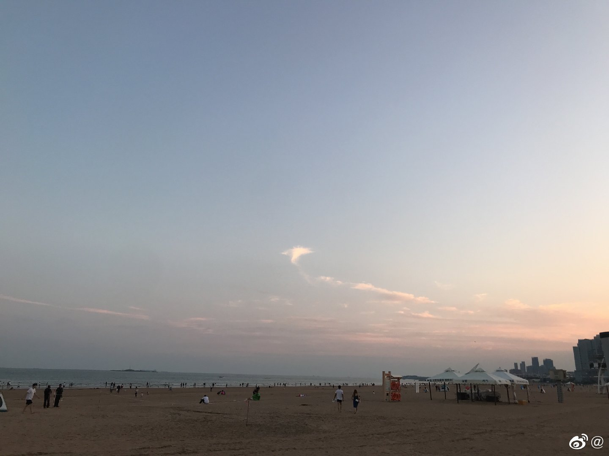
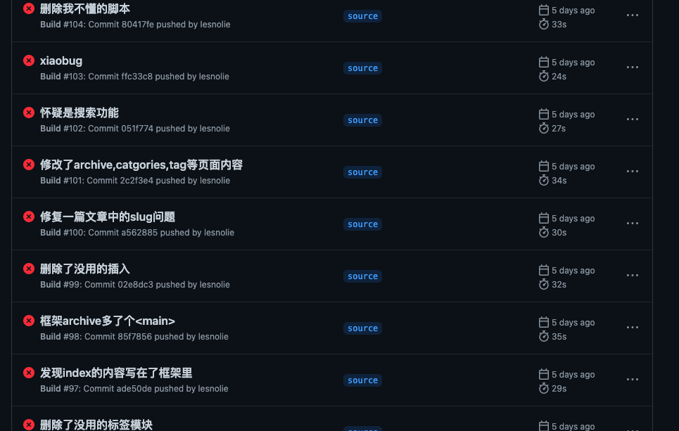

2021-9-31，这是我第一次去青岛的日子。去青岛的原因也很简单，因为喜欢的人在青岛。

说来也是挺可笑的，一个快30岁的男生，为了一个网恋的女孩，说走就走的奔向了青岛见面。听起来幼稚，不可理喻。

但是我知道，这一切都是值得的。

## 在路上

说起来很奇怪，在为去青岛做准备的日子里，我发现深圳去一次青岛的可选择性实在是太少了。

当然这个少，指的是**性价比高**，而不是交通路径少。飞青岛，所有的机票都是1300以上，但凡有个便宜的，不是停宁波就是停上海，着实不太顺畅。而高铁呢，竟然没有直达！从以上就可以看出深圳和青岛的友谊还需要我和lxy一起建立。

所以最后我的选择是飞去济南，搭高铁去青岛。

我一直没有细算到底合适不合适，借此机会来算一下：

| 飞机 |  火车  | 汽车 |  合计  |
| :--: | :----: | :--: | :----: |
| ¥640 | ¥121.5 | ¥20  | ¥801.5 |
| ¥485 | ¥116.5 | ¥20  | ¥621.5 |

这么一看确实很划算呀，嘻嘻嘻这个决定很正确呢。

## 在青岛

现代年轻人的现状，无论计划做的多么充沛，到了那一天也是在床上度过的。

嗯，所以我直接没有做计划，我对Lxy说，我不是因为青岛是青岛所以要去青岛，我是因为你在青岛所以要去青岛。青岛对我来说就是一个地方而已，正因为这个地方有了你，所以我才来的青岛。

潜台词就是，无论青岛有什么风景，都不及你的一丝美丽。

更潜台词是，别计划了，到时候我们肯定会白天睡觉点外卖，晚上吃饭的。

所以，此次青岛之行，唯一领略的风景就是海边。

嗯，我一个深圳人，家买在离海半小时的地方，不远万里飞到青岛看海。乍一听是不是脑袋进水了。所以当lyx问我，我们去海边吧去海边吧，我第一反应就是，不能去啊，去了就是脑袋进水，我不能承认我脑袋进水了。

回往过去，不去海边的一个原因是，无人陪伴，要么自己去，要么和家人去。和家人去呢，免不了磕磕碰碰的不开心，自己去呢，算了去一次太麻烦了。

也正因如此，此次在海边，是真真切切的第一次和喜欢的人牵手漫步在海滩。

青岛的沙滩和惠州的沙滩不一样，后来我和lxy总结出来的结果是，退潮了！

当日还写了散文一篇，在此附上：

> 青岛的天气好舒服，或者说除了广东应该都这么舒服吧。
> 犹记得那年成都的天气也这么舒服。
> 与深圳相比，北方姑娘可太高了，一眼望去几乎1.6是平均身高。
> 可深圳的姑娘也是全国各地来的，所以究竟是深圳人矮，还是矮的都来深圳了？
> 嚯，不能再往下谈了，总是都是好姑娘。
> 不知为何，我总觉得山东人的皮肤也是红彤彤的，但又和云南的黑不同。更像是红土地的那种红。
> 这儿的海水只有一个颜色，好神奇，惠州的海水近处是棕色的，远一点，绿的，再远一点，湛蓝。
> 远处有人在放风筝，近处是佳人相伴，海风习习。
> 普通的生活，简单的生活。
> 就像这儿的温度一样。
> 简单的舒服，没有复杂的日晒湿度等等等等。
> 就只有舒服而已。

文中没有提到的是，我与lxy同学的约定。后来的某一天，我们都要结婚了，就再次来到这个海边，坐在现在的位置。我记住的位置是，一杆红旗🚩在我们俩的正中间，她记住的位置是，天上最亮的那颗星😷。

啊，不得不感叹一句，海边可太适合唱歌了！

## 在凌晨

基于我睡觉不规律的现状，无论是在飞机上，火车上，汽车上，还是在酒店的床上，只要我睡不着并且只有我一个人的时候，就开始捣鼓这个博客的代码。

虽然博客是抄一个大神的（熊猫小A），但是是真的好看，看起来好舒服，并且这是我写东西的地方，并不打算给别人知道，抄袭的罪孽也就没那么深了。

无论是html还是css我是一窍不通，因为我不是程序员呀，当年考大学填志愿我妈大笔一挥，我就从软件工程变成了化学工程，然后颓废了至今已有几十年。

所以我依照自己的学习方法，那就是

> ***整理提出问题，搜索解决办法，解决问题***

从实践当中学习，伟人说过：实践是检验真理的唯一标准，我深以为然。从高中开始，从一个酷爱数学的同学身上，我学习到了这个学习办法。那时的某一天，我突然发现他数学练习册写完了，那时候才刚开学一两个月吧，我说你都会写吗？他说不会的看书啊，我说写那么快干啥，他说写完了就可以写其他的了呀。

从这段对话当中，我抓住了两个要点：

1. 不会的可以自学看书，不必总是等老师教
2. 学无止境，提前解决问题并不是为了提前完成任务，而是为了提前开始新的学习

所以，这个博客是如何制作的呢？

- 找到原作者分享的theme，因为里面含有结构，逻辑等等
- 找到原作者的我最喜爱的博客，将其html和css以及用到的js等都下载下来。
- 改成自己的theme。

总结下来就这三步。当然其中遇到了许许多多的问题，因为不懂python，不懂html，不懂css，所以当gitaction发生错误的时候，我是莫名其妙的，但是我会判断，我大概知道哪个位置有问题，于是乎我就在那个位置一点一点的修改。

于是，这个博客就诞生了。

这个博客的定位就是，日常。

他不是笔记，他就像日记，是我情感抒发的地方，所以才不会给很多人看。

而我的笔记，将会放在notion上，这也是我接下来要进发的方向。

## 未来

我与lxy的未来，此时此刻我无比的确信，lxy就是我命中的女孩。从来没有这么坚信过，即使我们现在相隔十万八千里。我从遇见lxy开始我就发现我和她如此的情投意合，无论是脾性，还是等等，竟然全部在对方的点上。

她很在乎我，我很在乎她。

也许你们不懂什么是在乎，用她的话讲：我会在她想要亲亲的时候不用她提醒就亲亲她。

而用我的话讲：我离开青岛时她眼中的泪水。

在乎就是，不用对方提醒，就自然而然的为对方着想，关心。并且一切的行动，都会令对方心动。

之前我觉得自己在乎，可对方却觉得我烦，这就不是情投意合，这就是不合适。

呐，lxy，你想和我走过一生吗？

### 工作

当然，更重点的是，我要开始工作了。

嗯，想让lxy幸福的前提就是赚钱，赚好多好多钱。

我与其他人相比，没什么优势，也是个平凡的人，不要天天想着自己一赚钱就能赚很多钱。

赚钱以后就可以解决日照到深圳的烦恼，就可以让lxy过上好日子，就可以让他们家人也过上好日子。

简单的就说这么多，该如何工作以及做什么，还需要耐心思考。

